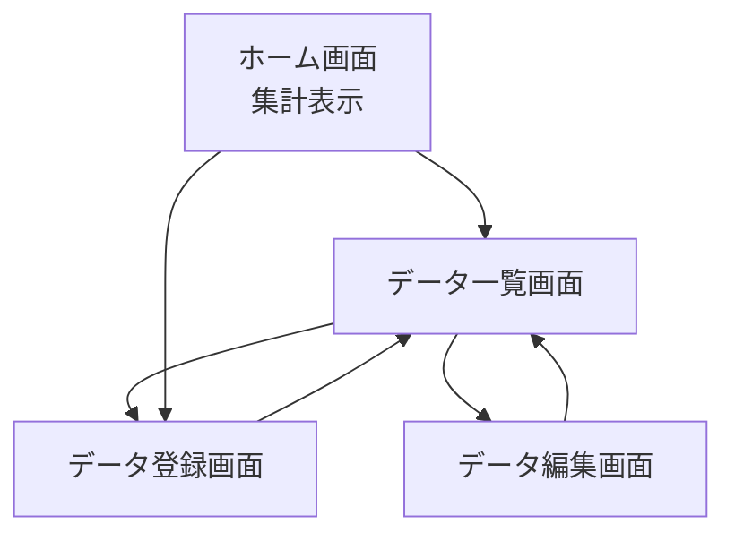
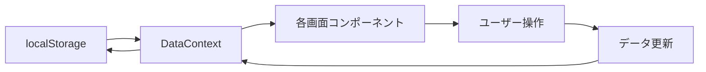

# 詳細設計仕様

## データ構造

### 登録データのフィールド仕様

| フィールド名 | データ型 | 必須/任意 | 制限・仕様 |
|-------------|----------|----------|-----------|
| 名称 | 文字列 | 必須 | 50文字以内 |
| 取得価格 | 数値 | 必須 | 正の数値 |
| 支払間隔 | 選択肢 | 必須 | ドロップダウン：一括/毎月/毎年（デフォルト：一括） |
| 支払期間 | 日付範囲 | 任意 | 開始日と終了日のペア、過去日も許容 |
| 想定利用期間 | 日付範囲 | 必須 | 開始日と終了日のペア、過去日も許容 |
| 分類 | 文字列 | 任意 | 20文字以内 |

### 計算フィールド

#### 1日あたりコストの計算ロジック

1. **一括支払いの場合**:
   - 1日あたりコスト = 取得価格 ÷ 想定利用期間の日数

2. **定期支払い（毎月・毎年）の場合**:
   - **支払期間が指定されている場合**:
     - 支払回数 = 支払期間の日数 ÷ 支払間隔の日数（切り上げ）
     - 総支払額 = 取得価格（1回あたり） × 支払回数
     - 1日あたりコスト = 総支払額 ÷ 想定利用期間の日数
   
   - **支払期間が指定されていない場合**:
     - 支払回数 = 想定利用期間の日数 ÷ 支払間隔の日数（切り上げ）
     - 総支払額 = 取得価格（1回あたり） × 支払回数
     - 1日あたりコスト = 総支払額 ÷ 想定利用期間の日数

#### 表示用計算

**支払間隔を考慮した正確な計算方式**

1. **一括支払いの場合**:
   - 1ヶ月あたりコスト = 1日あたりコスト × 30
   - 1年あたりコスト = 1日あたりコスト × 365

2. **毎月支払いの場合**:
   - 1ヶ月あたりコスト = 取得価格（登録された月額）
   - 1年あたりコスト = 取得価格 × 12

3. **毎年支払いの場合**:
   - 1ヶ月あたりコスト = 取得価格 ÷ 12
   - 1年あたりコスト = 取得価格（登録された年額）

**集計表示**: 各アイテムの月額・年額を個別に計算してから合計

#### 金額表示フォーマット

**表示形式の統一**
- 全ての金額表示（1日、1ヶ月、1年）は小数点以下を四捨五入して整数表示
- 日本円フォーマット（¥記号付き、3桁区切りカンマ）を使用
- 実装：`formatCurrency`関数と`formatDailyCost`関数で統一処理

#### 支払間隔の日数換算
- 一括: 想定利用期間の日数（1回のみの支払い）
- 毎月: 30日
- 毎年: 365日

## UI/UX設計

### 画面構成
複数ページ構成：
1. **ホーム画面（集計表示）** - メインページ、全体の集計情報を表示
2. **データ一覧画面** - 登録されたデータの一覧表示・管理
3. **データ登録画面** - 新規データの登録
4. **データ編集画面** - 既存データの編集

#### ホーム画面詳細設計

**総コスト表示エリア**
- 総コストを大きく表示、左右の三角形アイコンで表示期間（日/月/年）を切り替え
- 下部に1日・1ヶ月・1年の金額を並列表示

**分類別円グラフ**
- 総コスト表示の直下に円グラフで分類別内訳を表示
- 分類ごとに色分け表示、ツールチップで詳細情報表示

**高コストアイテムランキング表**
- 個別アイテムの高コストランキングを表形式で表示
- 表示範囲：1日あたりのコスト順で上位10件
- 表示列：順位、名称、1日
- ソート：1日コストの降順（金額の大きい順）
- 名称列は幅を最大化し、長い名称も表示できるよう改行対応
- アイテムが0件の場合は非表示
- 表見出しは自明のため非表示

**分類別集計表**
- 表形式で分類別の内訳を表示
- 表示列：分類、件数、1日、1ヶ月、1年
- ソート：1日コストの降順（金額の大きい順）
- 各分類の月額・年額は支払間隔を考慮して正確に計算

#### データ一覧画面詳細設計

**一覧表示（MUI X Data Grid使用）**
- データグリッド形式でアイテム一覧を表示
- 表示列：操作、名称、価格、支払間隔、開始日、終了日、分類、1日、1ヶ月、1年
- 操作列を先頭に配置して重要な編集・削除ボタンが常に表示
- 全期間のコストを同時に表示して比較を容易化

**ソート・フィルタ機能**
- 全ての列でソート機能（昇順・降順）
- 初期表示：1日コストの降順ソート
- 各列にフィルタ機能：文字列検索、数値範囲指定、日付範囲指定
- リアルタイムでのデータ絞り込み

**ページネーション**
- 5件、10件、25件の表示件数切り替え
- ページ送り機能で大量データに対応

### 検討事項
- 各画面の詳細レイアウト設計
- ナビゲーション設計
- レスポンシブデザイン対応
- PWA対応の詳細

## 技術スタック

### 確定事項
- Next.js（クライアントサイドアプリ）
- PWA対応
- サーバーレス構成
- データ永続化：localStorage
- UIライブラリ：Material-UI (MUI) + MUI X Data Grid
- 状態管理：React Context + useState
- 日付操作：Day.js
- グラフライブラリ：Recharts

## 実装計画

### プロジェクト構造
```
Hiwari/
├── src/
│   ├── pages/
│   │   ├── index.tsx          # ホーム画面（集計表示）
│   │   ├── items/
│   │   │   ├── index.tsx      # データ一覧画面
│   │   │   ├── new.tsx        # データ登録画面
│   │   │   └── [id]/edit.tsx  # データ編集画面
│   ├── components/
│   │   ├── Layout.tsx         # 共通レイアウト
│   │   ├── Navigation.tsx     # ナビゲーション
│   │   ├── ItemForm.tsx       # データ入力フォーム
│   │   ├── ItemList.tsx       # データ一覧表示
│   │   ├── SummaryCard.tsx    # 集計カード
│   │   └── CategoryPieChart.tsx # カテゴリ別円グラフ
│   ├── context/
│   │   └── DataContext.tsx    # データ管理Context
│   ├── hooks/
│   │   ├── useLocalStorage.ts # localStorage操作
│   │   └── useItems.ts        # アイテム操作
│   ├── utils/
│   │   ├── calculations.ts    # コスト計算ロジック
│   │   └── dateHelpers.ts     # 日付操作ヘルパー
│   └── types/
│       └── index.ts           # TypeScript型定義
```

### データモデル
```typescript
interface Item {
  id: string;
  name: string;
  price: number;
  paymentInterval: 'once' | 'monthly' | 'yearly';
  paymentPeriod?: {
    startDate: string;
    endDate: string;
  };
  usagePeriod: {
    startDate: string;
    endDate: string;
  };
  category?: string;
  costPerDay: number;
  createdAt: string;
  updatedAt: string;
}

interface CategorySummary {
  category: string;
  totalCostPerDay: number;
  totalCostPerMonth: number;
  totalCostPerYear: number;
  itemCount: number;
}

interface SummaryData {
  totalCostPerDay: number;
  totalCostPerMonth: number;
  totalCostPerYear: number;
  categorySummary: CategorySummary[];
}
```

### 実装フロー
1. **プロジェクト初期化** - Next.js + TypeScript + MUI + PWA設定
2. **基盤構築** - Context、型定義、ユーティリティ関数
3. **共通コンポーネント** - Layout、Navigation
4. **データ管理機能** - CRUD操作、localStorage連携
5. **各画面の実装** - ホーム → 一覧 → 登録 → 編集
6. **PWA対応** - Service Worker、マニフェスト
7. **テスト・デバッグ** - 動作確認、バグ修正

### 画面遷移図


### データフロー図
